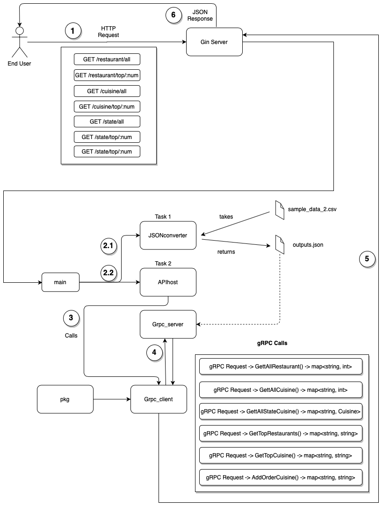

# Order Analysis

### Overview

This program reads from a CSV file line by line and converts each row to JSON and writes to an outfile.

The following results are generated using the JSON file:

1. least and best performing restaurants and cuisines :

    APIs:
    
    - restaurant/all(GET):  Shows all restaurants along with the number of orders made from them.
    
    - restaurant/top/{num}(GET): Show top num restaurants based on the number of orders made from them. Negative num would give least popular restaurants based on number of orders.
    
    - cuisine/all(GET): Shows all cuisnes along with the number of orders made for them.
    - cuisine/top/{num}(GET): Show top num cuisnes based on the number of orders made for them. Negative num would give least popular cuisines based on number of orders.
    
    
2. Target demographic of customers according to specific cuisine :

    APIs:
    
    - state/all(GET): Shows cuisine wise number of orders for each state.
    - state/top/{state}/{num}(GET): Show top num cuisines of given state with respect to number of orders made.
    
3. Add orders :
    
    API:
    
    - order/add(POST): Adds an order and also gives error if order of that order ID already there.
    
Added basic authentication to all APIs.


### Context Diagram



### Data

```
type Order struct {
	Id          int
	Discount    float64
	Amount      float64
	PaymentMode string
	Rating      int
	Duration    int
	Cuisine     string
	Time        int
	CustId      int
	CustName    string
	RestId      int
	RestName    string
	State       string
}

```

### Project Directory Structure
```
.
├── bin
│   └── protoc-gen-go
├── cmd
│   ├── APIhost
│   │   └── mainAPIs.go
│   ├── Grpc_server
│   │   └── grpc_server.go
│   └── JSONconverter
│       └── main.go
├── pkg
│   ├── AuthUtil
│   │   └── AuthUtil.go
│   ├── ErrorHandlers
│   │   └── lib.go
│   ├── FileUtil
│   │   └── FileUtil.go
│   ├── Grpc_client
│   │   └── Grpc_client.go
│   ├── Models
│   │   ├── models.go
│   │   └── relationships.go
│   ├── darwin_amd64
│   │   ├── github.com
│   │   │   ├── gin-gonic
│   │   │   │   └── gin.a
│   │   │   ├── jyotishp
│   │   │   │   └── order-analysis
│   │   │   │       └── pkg
│   │   │   │           └── FileUtil.a
│   │   │   └── tamerh
│   │   │       └── jsparser.a
│   │   └── google.golang.org
│   │       └── grpc.a
│   └── services
│       └── orders
│           └── orderspb
│               ├── orders.pb.go
│               └── orders.proto
├── readme.md
```

### Instructions:

External libraries used:

"github.com/gin-gonic/gin" and "github.com/tamerh/jsparser" add them using go get -u command.

Sample csv file is available at https://github.com/jyotishp/order-analysis/releases/download/v2/sample_data_2.csv.zip

Download it and place it inside JSONConverter directory.

go run main.go

outputs.json is generated inside JSONConverter directory.

place the json file inside Grpc_server directory.

go run grpc_server.go to start the grpc server(takes around 16 seconds to start)

go to new terminal instance and cd cmd/APIhost

go run mainAPIs.go to start the gin server at localhost:5665 and run the above mentioned APIs in browser or Postman.


